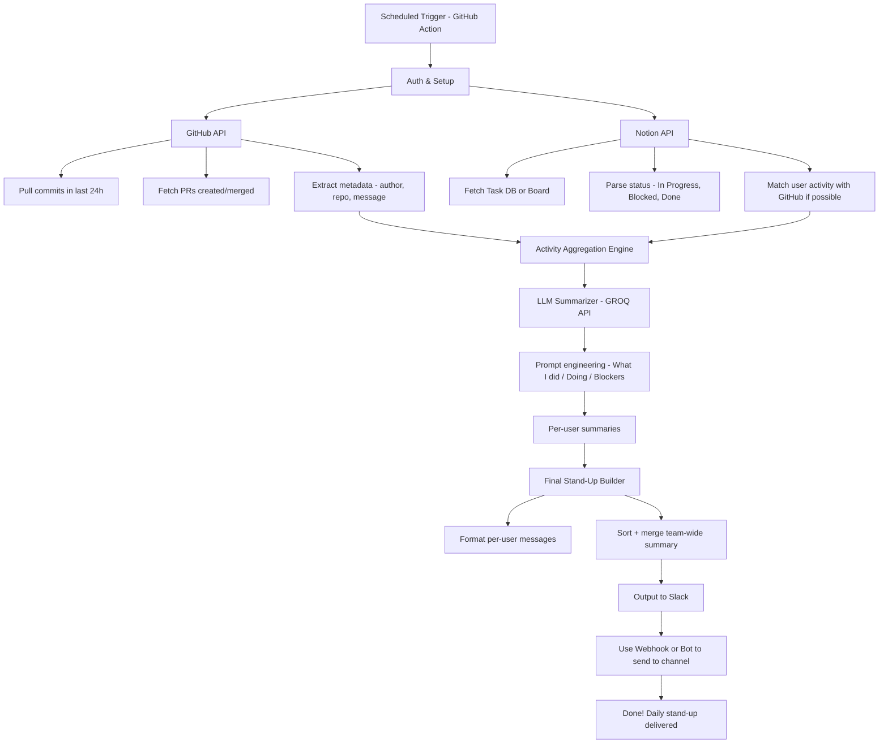

# Auto Standup Agent 


A lightweight agent that pulls activity from GitHub and Notion, summarizes each team member’s progress using a language model, and sends a clean Slack update. Designed for teams who want async visibility without the overhead of manual standups.

## What It Does

1. **Fetches activity** from GitHub (commits, PRs) and Notion (task status).
2. **Maps activity to individual contributors** using GitHub usernames and Slack IDs.
3. **Uses a local or API-based language model** to generate clear summaries (what was done, what’s in progress, blockers).
4. **Formats and sends messages to Slack** in a simple, readable format.


## How It Works

The agent runs automatically via GitHub Actions (or can be run manually). Here’s the flow:



---

## Getting Started

### 1. Clone the repo and install dependencies

```bash
git clone https://github.com/emanalytic/auto-standup-agent.git
cd auto-standup-agent
pip install -r requirements.txt
```

---

##  Configuration Guide

### A. Set your team’s GitHub and Slack info

Open the `config.ini` file and fill in your team details under `[members]`. This is how the agent links GitHub activity to Slack updates:

```ini
[members]
Eman_github = emanalytic
Eman_slack_id = U12345678

John_github = just-building
John_slack_id = U87654321
```

Add one line per user for both GitHub and Slack. IDs must match exactly.

---

### B. Set your config

Also in `config.ini`, set the language model you’re using under `[settings]`:

```ini
[settings]
model = llama3-70b-8192
```
Update the slack channel you want to post the message
```ini
[settings]
slack_channel=#daily-standup
```
Choose the GitHub mode:

`mode = org` — fetch activity from all organization repositories
`mode = repo` — fetch from a single specified repo

```ini
[settings]
mode = org  ; or "repo"
organization = my-org-name  ; required if mode is "org"
owner = username            ; required if mode is "repo"
repo = repo-name  
```
---

## Add GitHub Secrets

You'll need these for the agent to fetch data and send messages.

Go to:  
**Repository → Settings → Secrets and variables → Actions → New repository secret**

Add the following:

| Secret Name       | Description                              |
|-------------------|------------------------------------------|
| `G_TOKEN`         | GitHub Personal Access Token             |
| `SLACK_BOT_TOKEN` | Slack Bot Token                          |
| `NOTION_TOKEN`    | Your Notion integration token            |
| `GROQ_API_KEY`    | API key for LLM summarization            |
| `DATABASE_ID`     | Notion database ID (where your tasks live) |

---

### B. GitHub Actions: Auto-Run Daily

This project includes a GitHub Action that can run the agent automatically every day.

#### To **enable** the daily auto-run:

1. Open `.github/workflows/standup.yaml`.
2. **Uncomment** the `schedule:` section and keep `workflow_dispatch:` to allow both daily automatic runs and manual triggers.

```yaml
on:
  schedule:
    - cron: '42 16 * * *'  # Runs every day at 4:42 PM UTC
  workflow_dispatch:       # Allows you to run it manually
```
#### **Customizing the Trigger Time**

You can adjust the cron expression to change the time of day when the agent runs. For example, to make it run at 8 AM UTC, change it to:

You can change the schedule timing [using this guide](https://crontab.guru/).

## Microsoft Teams Integration

Require Microsoft 365 (business or enterprise) account to use the Teams integration for Webhook.

---

## Run Locally

If you want to test before pushing:

```bash
python -m agent.standup_agent
```

Make sure the required environment variables are available. You can use a `.env` file or export them in your shell.

---

## Example Slack Output


---

## Extending the Agent

You can plug in other tools like Jira, Linear, or custom Git sources. Just update the fetchers inside:

```
tools/
├── github_fetcher.py
├── notion_fetcher.py
├── slack_poster.py
```

And adjust the prompt logic in:

```
agent/standup_agent.py
```

---

## License

MIT License
